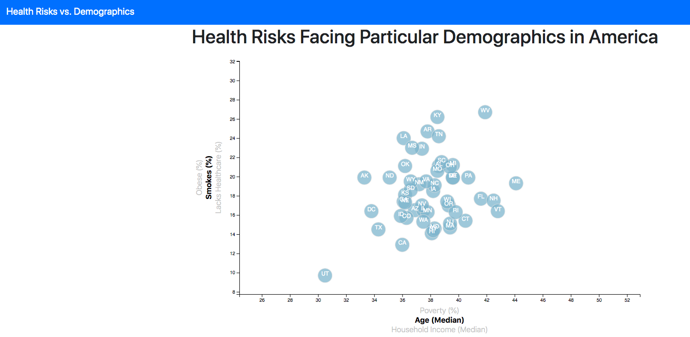
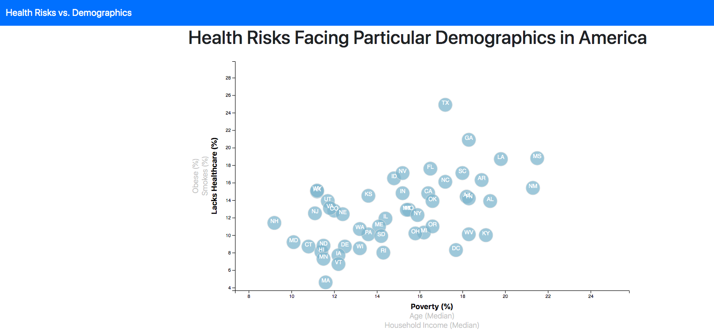
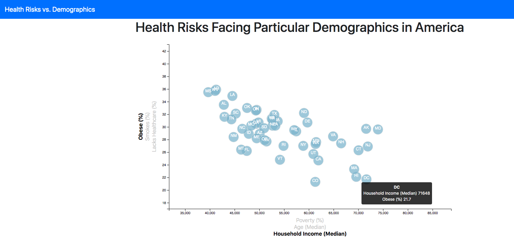

# Data-Journalism-and-D3 

 

## Background

Utilizing information from the U.S. Census Bureau and the Behavioral Risk Factor Surveillance System, create charts, graphs and interactive visualizations to help understand findings

The data set included is based on 2014 ACS 1-year estimates: [https://factfinder.census.gov/faces/nav/jsf/pages/searchresults.xhtml](https://factfinder.census.gov/faces/nav/jsf/pages/searchresults.xhtml). The current data set incldes data on rates of income, obesity, poverty, etc. by state. MOE stands for "margin of error."

## Objectives

### Level 1: D3 Dabbler

Create a scatter plot between two of the data variables such as `Healthcare vs. Poverty` or `Smokers vs. Age`

* Using D3 techniques, create a scatter plot that represents each state with circle elements. You'll code this graphic in the `app.js` file. Make sure to pull in the data from `data.csv` by using the `d3.csv` function. 
    * Include state abbreviations in the circles
    * Create and situate your axes and labels to the left and bottom of the chart

### Level 2: Impress the Boss

Utilize D3 to help interact with the data

#### 1. More Data, More Dynamics

Include more demographics and more risk factors. Place additional labels in the scatter plot and give them click events so that users can decide which data to display. Animate the transitions for circles' locations as well as the range of the axes. Do this for two risk factors for each axis. Or, for an extreme challenge, create three for each axis.

#### 2. Incorporate d3-tip

While the ticks on the axes allow one to infer approximate values for each circle, it's impossible to determine the true value without adding another layer of data. Enter tooltips: developers can implement these in their D3 graphics to reveal a specific element's data when the user hovers their cursor over the element. Add tooltips to your circles and display each tooltip with the data that the user has selected

